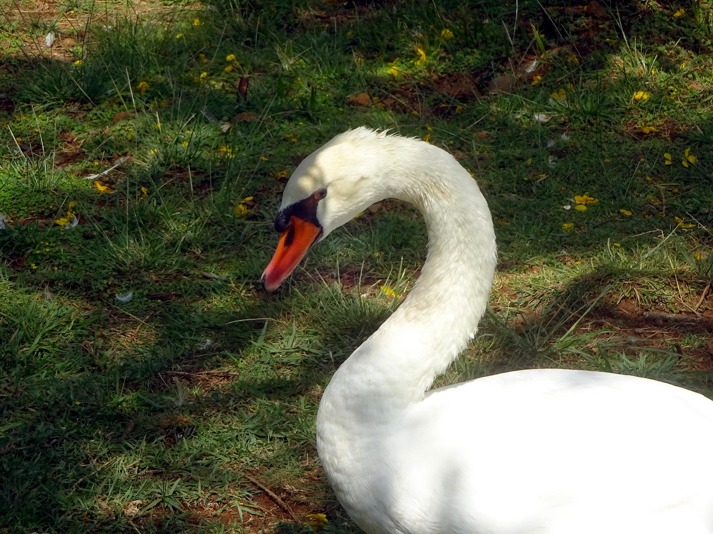

# PhotoBooster

With this tool, you can put all your vacation photos in one folder and then automatically optimize them. PhotoBooster performs white balance and saturation boost to remove any issues in illumination in your photo and also makes the colors look more saturated.

PhotoBooster uses the 
* CAT02 color space for chromatic adaption
* HSI color space for saturation boost

It is implemented in OpenCL (using [pyopencl](https://mathema.tician.de/software/pyopencl/)).

# Getting started

* The easiest way is to install [Anaconda](https://www.anaconda.com/download/). 
* Create environment by e.g.,
```
conda create -n photo python=3.6.3
```
* Install required packages
```
* conda install pyopencl
* conda install -c conda-forge imageio
```

# Run
```
python PhotoBooster.py -i D:\Test
```
This will process all images in "D:\Test" and store the result in "D:\Test\PhotoBooster".

# Remarks
It is far away from any usability but for now I don't care. Sorry.

If you are brave enough to use it and / or contribute --> thumbs up :) .

# Examples
Original

Boosted

Original

Boosted
